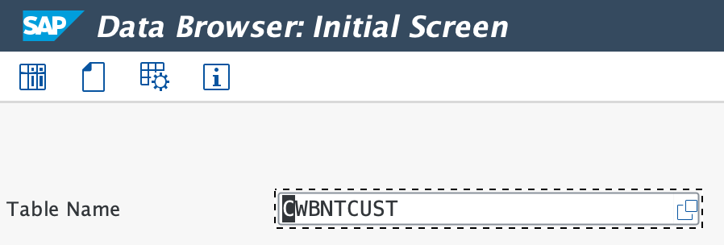
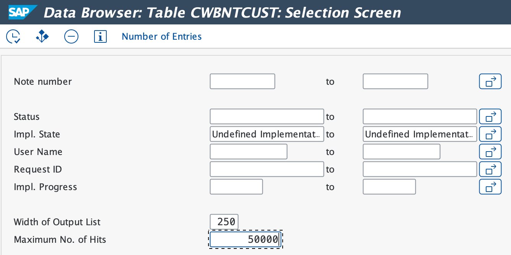
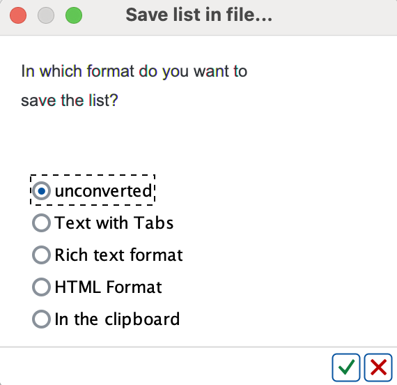
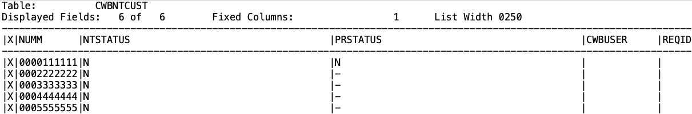
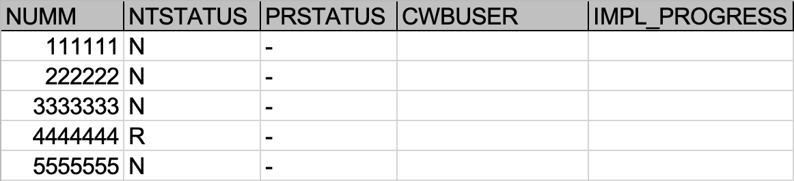
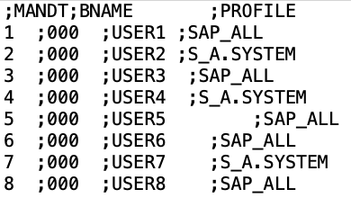

# How to extract table content from SAP
When logging into SAP, select English.

* Go to transaction SE16 (Data Browser). Enter the transaction code "/nSE16" in the command field on the SAP GUI and press Enter.
* On the next screen set the name of the table you wish to export (For inst. CWBNTCUST, RFCDES, UST04). Press Enter.

* On next screen extend Maximum No. of Hits (For inst. set it to 1000000, to extract all rows from the table)

* (for RFDES table only) In order to download all data from the RFCDES table you need to choose ALV List Mode in the menu Settings -> User Parameters... It allows you to extract more data from long column RFCOPTIONS.
* (optionally) If you'd like to exclude some columns (For inst. with sensitive info) go to menu Settings -> Format List -> Choose Fields... and unselect columns which you want to exclude.
Required column list for tables:
  - RFCDES table - RFCDEST, RFCTYPE, RFCOPTIONS columns
  - UST04 table - MANDT, BNAME, PROFIL columns
  - USR02 table - MANDT, BNAME, GLTGB, GLTGV, USTYP, UFLAG, CLASS columns
  - CWBNTCUST table - NUMM, NTSTATUS, PRSTATUS, IMPL_PROGRESS columns
  - CWBNTHEAD table - NUMM, VERSNO, INCOMPLETE columns
  - AGR_USERS table - MANDT, AGR_NAME, UNAME, FROM_DAT, TO_DAT columns
  - AGR_1251 table - MANDT, AGR_NAME, OBJECT, AUTH, FIELD, LOW, HIGH, DELETED columns
* (for CWBNTHEAD table only) only for the CWBNTHEAD table you can significantly reduce exported table lines: Exclude in the INCOMPLETE table field value "X".
* (for AGR_1251 and AGR_USERS table only) only for the AGR_1251 and AGR_USERS tables you can significantly reduce exported table lines: Include only roles that start with Z,Y - custom roles (Z*, Y*).
* Press F8 (or click on Execute button).
* To extract table content in text format go to menu System -> List -> Save -> Local file. Then choose Unconverted format

The text file example:

  - (optionally) To extract table content in XLSX format go to menu Table Entry -> List -> Export -> Spreadsheet...
  

Also, you can extract table content via HANA DB (HANA STUDIO).
  

Important note: To extract data from all clients at once (for inst. tables USR02, UST04) you can use HANA DB Studio or ST04 transaction. You can use the following queries:
* SELECT MANDT, BNAME, UFLAG, CLASS, USTYP FROM USR02
* SELECT MANDT, BNAME, PROFILE FROM UST04 WHERE PROFILE LIKE 'S%'
