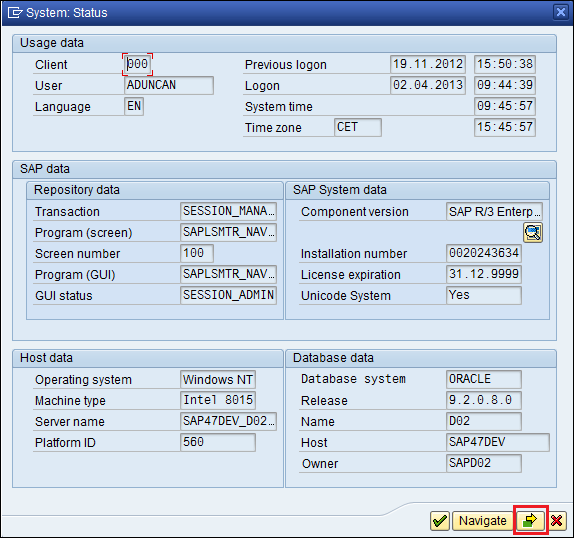
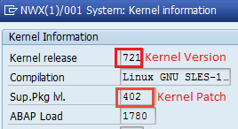

# How to Collect Kernel Information

This guide explains how to export the list of installed kernel version/patch level from an ABAP system, so this data can be reviewed for missing SAP Security Notes.

## Prerequisites

- Access to SAP GUI
- A user account with authorization to view system status

---

## Exporting Kernel Information (Kernel Version + Kernel Patch)

1. Log in to the SAP system using SAP GUI.
2. From the menu bar, go to **System → Status**.
3. In the status window, click the **Kernel Information** button (the button will be at the bottom of the window)

4. In next popup window you can find Kernel Version and Kernel Patch

