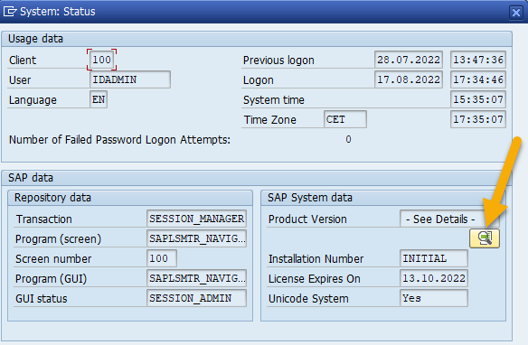
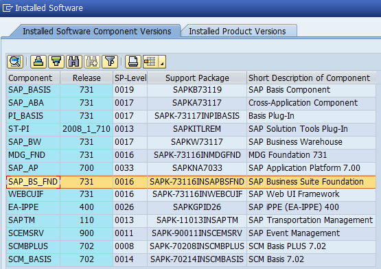

# How to Collect ABAP Software Component Information

This guide explains how to export the list of installed software components from an ABAP system, so this data can be reviewed for missing SAP Security Notes.

## Prerequisites

- Access to SAP GUI
- A user account with authorization to view system status

---

## Exporting Installed Software Components

1. Log in to the SAP system using SAP GUI.
2. From the menu bar, go to **System → Status**.
3. In the status window, click the **Installed Software** button to open the component list (the button will be close to the Production Version or the Component Version field).

4. The window now displays all installed software components and their release/patch versions.

5. Copy the full table to a file:
    * Option A
      - Right click on any line in the table. Choose Spreadsheet and save the content to Excel spreadsheet (`.xlsx`).   
    * Option B
      - Click the first line of the table to select it.
      - Press **Ctrl+A** to select all rows, then **Ctrl+C** to copy.
      - Open a plain text editor, create a new file, and paste (**Ctrl+V**) the clipboard contents.
      - Save the file with a `.txt` extension, using **UTF-8** encoding.
      
      **Note:** Troubleshooting: large component lists
      If the table contains more rows than fit on a single screen, selecting with **Ctrl+A** immediately may trigger the following error: Not all data was  added to the clipboard.

        To work around this:
        1. Click the first line of the table to set the starting point.
        2. Slowly scroll down through the entire table until you reach the last row, so all rows are rendered.
        3. Press **Ctrl+A** then **Ctrl+C**. All rows will now be copied to the clipboard.
        4. Paste into your text file as described in step 5 above.
