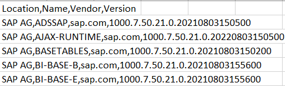

# How to generate SAP JAVA Security Note Report
1. Login to SAP NetWeaver JAVA system
2. Find SAP JAVA software components according to [Note 1757810](https://launchpad.support.sap.com/#/notes/1757810)
3. Save software components list to CSV file (If you have only one option save as Excel spreadsheet, save it in XLS file and then convert to CSV)
4. Check column names. They should be: Location, Name, Vendor, Name. A column order is not important. "SAP AG" is Location, "sap.com" is Vendor.


5. Run in command line interface:
```sh
offlinesec_java_notes -f "java_softs.csv" -s "System JAVA"
```

You can also specify in command line an exclusion list for notes as usual.