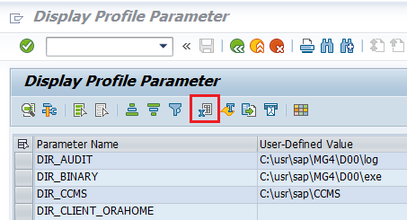

# How to generate SAP Profile Parameters Report
To collect information about current values of profile parameters in SAP System do the following:
1. Log in SAP System using SAP GUI software
2. Call SA38 or SE38 transaction
3. Perform RSPARAM report
4. Press F8 to proceed
5. Save table content to file (Excel)


To send prepared file to server run the following script:
```sh
offlinesec_sap_notes -f "rsparam.xlsx" -s "Demo System"
```
where "rsparam.xlsx" - prepared text file (step 5), for your convenience, you can specify system name - string max 20 characters (Don't add to this field sensitive information!).

if you would like to check if the file contains any sort of sensitive information you can split process:
```sh
offlinesec_sap_notes -f "rsparam.xlsx" -s "Demo System" --do-not-send
```
Then open archive and review file content. If everything is ok you can proceed with the following command:
```sh
offlinesec_sap_notes -z "rsparam.zip"
```