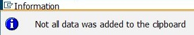
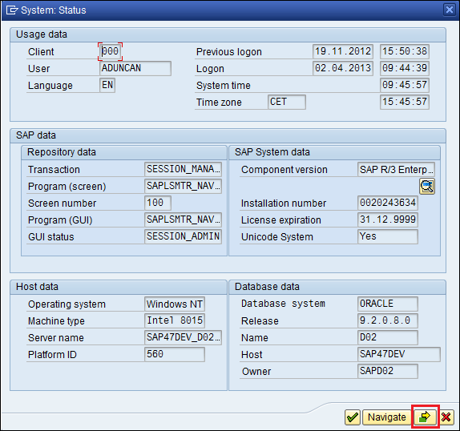
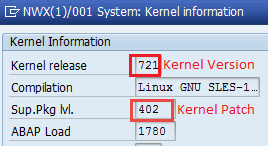
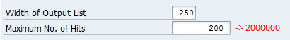
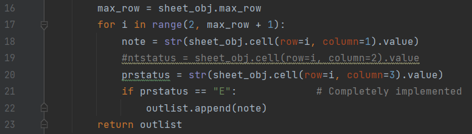

# How to generate SAP Security Note Report

* [SAP Businees Objects](./docs/how_to_prepare_bo_version.md)
* [SAP NetWeaver JAVA](./docs/how_to_prepare_java_softs.md)

To collect information about installed software components in SAP System do the following:
1. Log in SAP System using SAP GUI software
2. Go to System -> Status (Menu)
3. Open the Installed Software window<br />

4. You can see the window with installed software components and their versions.<br />

5. Now you need to copy all information to text file(utf-8 coding). Please highlight first line then press Ctrl+A (select all) and Ctrl+C (copy to clipboard).
Create new text file (.txt extension) and insert all data from the buffer. The file should look like this:<br />


* Important Note: if you encounter the following error message<br />


You should do the following:
* Highlight first line in the table
* Slowly scroll down the table until the end
* Press Ctrl+A, Ctrl+C. Now All information from the table was copied to buffer.

To send prepared text file to server run the following script:
```sh
offlinesec_sap_notes -f "software_components.txt" -s "Demo System"
```
where "software_components.txt" - prepared text file (step 5), for your convenience, you can specify system name - string max 20 characters (Don't add to this field sensitive information!).

## For those who need more
### GUI Scripting
For those who installed offlinesec_client on Windows platform it's available gui scripting option.
```sh
offlinesec_sap_notes --guiscript -s "Important System"
```
Do not forget to login SAP using SAP Logon and enable sap gui scripting (Transaction RZ11 and the sapgui/user_scripting parameter).

### Wait 5 minutes
Not to forget download your Offline Security report You can add -w option. 
```sh
offlinesec_sap_notes --guiscript -s "Production System" -w
offlinesec_sap_notes -f "software_components.txt" -s "Demo System" -w
```

### Add Kernel version and kernel patch
(Available since client version 1.0.14)
1. Log in SAP System using SAP GUI software
2. Go to System -> Status (Menu)
3. Open Kernel Information Window<br />

4. Save Kernel Version and Kernel Patch<br />

5. Append this information to server request:
```sh
offlinesec_sap_notes -f "software_components.txt" -s "Demo System" -k 721 -p 402
```

### Add information regarding implemented sap notes (without package)
(Available since client version 1.0.14)
1. Log in SAP System using SAP GUI software
2. Go to transaction SE16
3. Type CWBNTCUST table to browse
4. !!! Increase number of showed rows on next screen<br />

5. Save Table Content to xlsx file <br />

6. Add table file to server request:
```sh
offlinesec_sap_notes -f "software_components.txt" -s "Demo System" -k 721 -p 402 -c "cwbntcust.xlsx"
```
Important Note: The table CWBNTCUST contains usernames. We do not send this sensitive information to server !!!
Please examine client source code.<br />
cwbntcust.py: <br />
