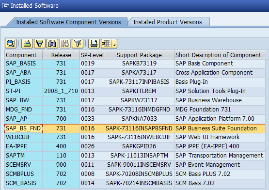

# How to generate SAP Security Note Report
To collect information about installed software components in SAP System do the following:
1. Log in SAP System using SAP GUI software
2. Go to System -> Status (Menu)
3. Open the Installed Software window<br />

4. You can see the window with installed software components and their versions.<br />

5. Now you need to copy all inforantion to text file. Please highlight first line then press Ctrl+A (select all) and Ctrl+C (copy information to buffer).
Create new text file and insert information from the buffer. The file should look like this:<br />


* Important Note: if you encounter the following error message

You should do the following:
* Highlight first line in the table
* Slowly scroll down the table until the end
* Press Ctrl+A, Ctrl+C. Now All information from the table was copied to buffer.

6. Insert information to text file. Save changes in the file. 

To send prepared file to server run the following command:
```sh
offlinesec_sap_notes -f "software_components.txt" -s "Demo System"
```
where "software_components.txt" - prepared text file (step 6), for your convenience, you can specify system name - string max 20 characters.
