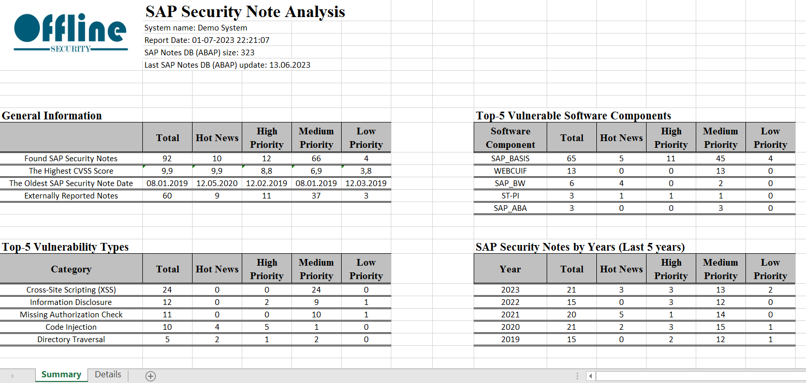
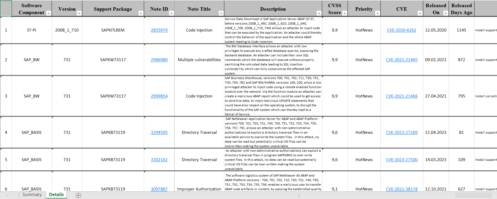

#SAP Security Notes Report
The report contains information about not-implemented SAP Security Notes (security vulnerabilities) relevant to particular SAP System. To generate report you need to gather information regarding installed software components ([Here]() you can find more details).  
The SAP Security Notes Report is Excel file with two pages. General information regarding found security issues is available on first page.

You can find all needed details on the second page of report.

